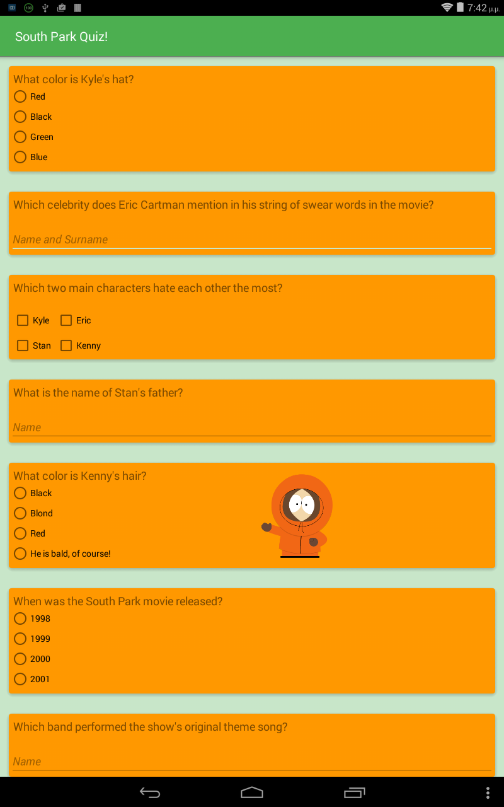
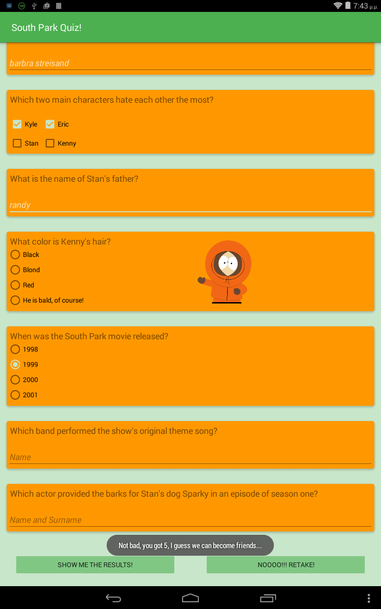

# South-Park-Quiz #
Quiz app for Project no 3 of the Android Basics Nanodegree by Udacity and Google. 

  

## Contents ##
The app consists of a 8- question quiz for one of my favorite  TV shows, South Park.
Different input types are supported:
- *RadioButton* for questions with only one right answer
- *CheckBox* for questions that require multiple answers to be chosen
- *EditText* for questions where the user is required to typre the correct answer
The Android *MusicPlayer* is also used to add some background music while the app is open.

## Showing the results ##
The "show me the results" button calculates and shows a toast message with the result, 
while the "Noooo!!! Retake" button resets all answers and lets the user try from the beginning.

## Built with ##
Android Studio.
